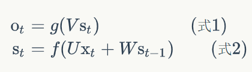

《神经网络与深度学习》第五章、第六章粗略阅读笔记

### 第五章 深度神经网络为何很难训练

深度神经网络：更多的隐藏层 

深度网络中，不同的层学习的速度差异很大

深度神经网络中使用基于梯度下降的学习方法本身存在着内在不稳定性。这种不稳定性使得先前或者后面的层的学习过程阻滞

观察隐藏层之间学习速度的差异，有这样一个结果：前面隐藏层中的神经元学习速度要慢于后面的隐藏层——消失的梯度问题（vanishing gradient problem）；一个不好的解决方法又会导致前面的层中的梯度变得非常大——激增的梯度问题（exploding gradient problem）

深度神经网络中的梯度是不稳定的，在前面的层中或消失或激增

#### 梯度不稳定性

前面的层上的梯度是来自后面的层上项的乘积，当存在过多的层次时，就出现了内在本质上的不稳定场景。所以如果使用标准的基于梯度的学习算法，在网络中的不同层就会出现按照不同学习速度学习的情况

总之“什么让训练深度网络非常困难”这个问题相当复杂，除了基于梯度的学习方法是不稳定的，激活函数的选择，权重初始化甚至是学习算法的实现方式也扮演了重要的角色。网络结构和其他超参数本身也是很重要的。

### 第六章 深度学习

本章主要的部分是介绍深度卷积网络

卷积神经网络是一个设法利用空间结构的架构（在解决图像识别问题的角度上）

卷积神经网络采用三种基本概念：局部感受野local receptive fields，共享权重shared weights，混合pooling

在图像识别的场景下解释这三个概念：

**局部感受野：**将输入像素（一幅图像）连接到一个隐藏神经元层，但并不把每个输入像素连接到每个隐藏神经元，只是把输入图像进行小的、局部区域的连接；确切来说，第一个隐藏层中的每个神经元会连接到一个输入神经元（像素）的小区域，这个区域就被称为隐藏神经元的局部感受野。它是输入像素上的一个小窗口，一个连接学习一个权重，而隐藏神经元同时也学习一个总的偏置。可以把这个特定的隐藏神经元看作是在学习分析它的局部感受野。

**共享权重和偏置：**局部感受野在原图像中按照所使用的跨距移动，构建起隐藏层，其中每个隐藏神经元具有一个偏置和连接到它的局部感受野的逐像素权重，且这一隐藏层中所有神经元都使用相同的权重与偏置。输入层到隐藏层的映射被称为一个**特征映射**，定义特征映射的权重称为共享权重，偏置称为共享偏置。共享权重和偏置经常被称为一个**卷积核**或者**滤波器**。共享权重和偏置的一个很大的优点是，它大大减少了参与的卷积网络的参数。

共享权重和偏置的使用意味着一个隐藏层中所有神经元检测完全相同的特征，只是在输入图像的不同位置；这能很好地适应图像的平移不变性。

**混合层：**又名池化层（pooling layer），通常紧接着在卷积层之后使用。它要做的是简化从卷积层输出的信息。混合层取得从卷积层输出的每一个特征映射（指隐藏神经元从该层输出的激活值），并从它们准备一个凝缩的特征映射。混合层的每一个单元会用来概括前一层的某个区域的神经元，例如最大值混合（max-pooling）就将这一个区域中的最大激活值输出。

另一个常用的混合方法是L2混合，它取区域中激活值的平方和的平方根。

一个典型的图像识别卷积神经网络结构：一层输入神经元，这些神经元用于对图像的像素强度进行编码；一个卷积层，使用axa的局部感受野和b个特征映射；一个最大值混合层，应用于cxc区域，遍及b个特征映射。网络中最后连接的层是一个全连接层。这一层将最大值混合层的每一个神经元连接到每一个输出神经元。

### 补充

#### 循环神经网络RNN

参考：https://zybuluo.com/hanbingtao/note/541458

对于某些任务，它们要求能够更好地处理序列的信息，即前面的输入和后面的输入是有关系的；RNN就是为了适应这样的任务提出的。

基本循环神经网络的计算方法可以用下面的公式表示：

该网络在t时刻接收到输入$x_t$之后，隐藏层的值是$s_t$，输出值是$o_t$，$s_t$的值不仅仅取决于$x_t$，还取决于$s_{t-1}$。式1是输出层的计算公式，输出层是一个全连接层，$V$是输出层的权重矩阵，$g$是激活函数。式2是隐藏层的计算公式，它是循环层。$U$是输入x的权重矩阵，$W$是上一次的值$s_{t-1}$作为这一次的输入的权重矩阵，$f$是激活函数。

循环层与全连接层的区别就是循环层多了一个权重矩阵W，反复把式2代入式1就可以看到，循环神经网络的输出值$o_t$是受前面历次输入值$x_t$、$x_{t-1}$、$x_{t-2}$、……影响的，这就是为什么循环神经网络可以注意到前面任意多个输入值的原因。

